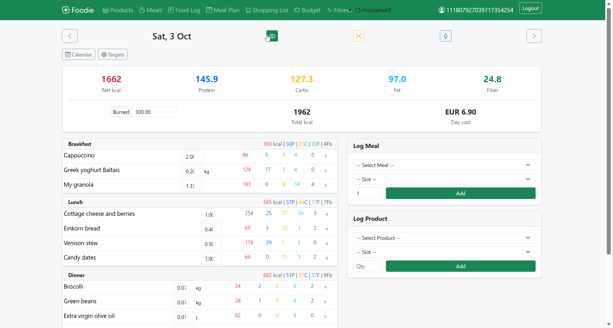

# 🍽️ FoodieApp

A comprehensive meal planning and nutrition tracking application with **AI-powered features** for effortless food logging. Built with Java 21 and Spring Boot 3.3.

[](https://openjdk.org/)
[](https://spring.io/projects/spring-boot)
[](https://github.com/ElgaVigrieze/foodieApp/actions/workflows/ci.yml)
[](LICENSE)

---

## ✨ Key Features

### 🤖 AI-Powered Capabilities

| Feature | Description | Technology |
|---------|-------------|------------|
| **Photo Nutrition Analysis** | Snap a photo of your meal → get instant calorie and macro estimates | Cloudflare Workers AI (Llama 3.2 Vision) |
| **Smart Recipe Import** | Paste any recipe URL (blogs, YouTube, Instagram) → auto-extract ingredients, instructions, and nutrition | Cloudflare Workers AI (Llama 3.3 70B) |
| **Recipe Screenshot Parsing** | Upload a screenshot of a recipe → extract structured data via vision AI | Cloudflare Workers AI (Llama 3.2 Vision) |
| **Voice Food Logging** | Speak what you ate → fuzzy matching finds meals/products in your database | Custom NLP parsing with word-overlap scoring |
| **Barcode Scanner** | Scan product barcodes → auto-fetch nutrition from Open Food Facts API | Open Food Facts Integration |

### 📱 Core Functionality

- **Meal Management** — Create, categorize, and track meals with detailed nutritional information
- **Product Database** — Maintain a personal product library with nutrition data (auto-filled from Open Food Facts)
- **Food Logging** — Track daily intake by meal slot (breakfast, lunch, dinner, snack)
- **Meal Planning** — Plan weekly meals with automatic shopping list generation
- **Shopping Lists** — Auto-generated from meal plans, with manual additions
- **Household Support** — Multi-user households with shared data and role-based access
- **Budget Tracking** — Track food spending alongside nutrition
- **Fitness Integration** — Log workouts and track training plans

---

## 🏗️ Architecture

```
┌─────────────────────────────────────────────────────────────────┐
│                        Frontend (Thymeleaf)                      │
├─────────────────────────────────────────────────────────────────┤
│                     REST API Controllers                         │
│  ┌──────────┐ ┌──────────┐ ┌──────────┐ ┌──────────┐           │
│  │ MealAPI  │ │ PhotoLog │ │ VoiceLog │ │ Barcode  │  ...      │
│  └──────────┘ └──────────┘ └──────────┘ └──────────┘           │
├─────────────────────────────────────────────────────────────────┤
│                       Service Layer                              │
│  ┌────────────────────┐  ┌────────────────────┐                 │
│  │ PhotoNutrition     │  │ RecipeScraper      │                 │
│  │ Service            │  │ Service            │                 │
│  │ (AI Vision)        │  │ (AI Text + Vision) │                 │
│  └─────────┬──────────┘  └─────────┬──────────┘                 │
│            │                       │                             │
│            ▼                       ▼                             │
│  ┌─────────────────────────────────────────────┐                │
│  │         Cloudflare Workers AI API            │                │
│  │   • Llama 3.2 11B Vision Instruct           │                │
│  │   • Llama 3.3 70B Instruct                  │                │
│  └─────────────────────────────────────────────┘                │
│                                                                  │
│  ┌────────────────────┐  ┌────────────────────┐                 │
│  │ NutritionLookup    │  │ RecipeIngredient   │                 │
│  │ Service            │  │ MatcherService     │                 │
│  │ (Open Food Facts)  │  │ (Fuzzy Matching)   │                 │
│  └────────────────────┘  └────────────────────┘                 │
├─────────────────────────────────────────────────────────────────┤
│                    Data Layer (JPA/Hibernate)                    │
│  ┌──────┐ ┌──────┐ ┌──────┐ ┌──────┐ ┌──────┐ ┌──────┐        │
│  │Meal  │ │Product│ │FoodLog│ │MealPlan│ │User │ │Household│    │
│  └──────┘ └──────┘ └──────┘ └──────┘ └──────┘ └──────┘        │
├─────────────────────────────────────────────────────────────────┤
│                   PostgreSQL / H2 Database                       │
└─────────────────────────────────────────────────────────────────┘
```

---

## 🛠️ Tech Stack

| Category | Technologies |
|----------|-------------|
| **Backend** | Java 21, Spring Boot 3.3, Spring Data JPA, Spring Security |
| **AI/ML** | Cloudflare Workers AI (Llama 3.2 Vision, Llama 3.3 70B) |
| **External APIs** | Open Food Facts (nutrition data, barcode lookup) |
| **Frontend** | Thymeleaf, Bootstrap |
| **Database** | PostgreSQL (production), H2 (development) |
| **Authentication** | OAuth2 (Google, GitHub) |
| **Deployment** | Docker, Fly.io |
| **Build** | Maven |

---

## 🚀 Getting Started

### Prerequisites

- Java 21+
- Maven 3.8+
- PostgreSQL (or use H2 for local dev)
- Cloudflare account (for AI features)

### Configuration

Create `application-local.yml` or set environment variables:

```yaml
# Database
spring:
  datasource:
    url: jdbc:postgresql://localhost:5432/foodie
    username: your_username
    password: your_password

# OAuth2 (optional)
spring:
  security:
    oauth2:
      client:
        registration:
          google:
            client-id: ${GOOGLE_CLIENT_ID}
            client-secret: ${GOOGLE_CLIENT_SECRET}

# Cloudflare AI (for photo/recipe analysis)
app:
  cloudflare:
    account-id: ${CLOUDFLARE_ACCOUNT_ID}
    api-token: ${CLOUDFLARE_API_TOKEN}
```

### Run Locally

```bash
# Clone the repository
git clone https://github.com/ElgaVigrieze/foodieApp.git
cd foodieApp

# Run with Maven
./mvnw spring-boot:run

# Or build and run the JAR
./mvnw package
java -jar target/foodie-0.0.1-SNAPSHOT.jar
```

Visit `http://localhost:8080`

### Run with Docker

```bash
docker build -t foodie .
docker run -p 8080:8080 \
  -e CLOUDFLARE_ACCOUNT_ID=your_id \
  -e CLOUDFLARE_API_TOKEN=your_token \
  foodie
```

---

## 🎬 Demo



## 📸 Screenshots

*Add additional screenshots to `docs/images/` and reference them here.*

---

## 📖 API Documentation

Once the app is running, access the interactive API documentation at:

- **Swagger UI**: [http://localhost:8080/swagger-ui.html](http://localhost:8080/swagger-ui.html)
- **OpenAPI JSON**: [http://localhost:8080/v3/api-docs](http://localhost:8080/v3/api-docs)

---

## 🔮 AI Features in Detail

### Photo Nutrition Analysis

Upload a photo of your meal and get instant nutritional estimates:

```
User uploads: [photo of pasta with meatballs]

AI Response:
  FOOD: Spaghetti with meatballs and marinara sauce
  CALORIES: 650
  PROTEIN: 28g
  CARBS: 72g
  FAT: 24g
  FIBER: 5g
  WEIGHT: 400g
```

### Smart Recipe Import

Paste any recipe URL and the AI extracts structured data:

```
Input: https://example.com/chicken-stir-fry-recipe

Output:
  Name: Chicken Stir Fry
  Category: MAIN_COURSE
  Servings: 4
  Ingredients:
    - Chicken breast: 500g
    - Broccoli: 200g
    - Soy sauce: 45ml
    - ...
  Instructions: "1. Cut chicken into cubes..."
```

The system then:
1. Matches ingredients to existing products in your database (fuzzy matching)
2. Creates new products for unmatched ingredients (auto-fills nutrition from Open Food Facts)
3. Saves the complete meal with calculated nutrition totals

---

## 📁 Project Structure

```
src/main/java/com/foodie/
├── config/          # Security, OAuth2 configuration
├── controller/      # REST endpoints and web controllers
│   ├── PhotoLogController.java      # AI photo analysis
│   ├── RecipeImportController.java  # AI recipe extraction
│   ├── VoiceLogController.java      # Voice input parsing
│   └── BarcodeController.java       # Barcode scanning
├── model/           # JPA entities
├── repository/      # Data access layer
└── service/         # Business logic
    ├── PhotoNutritionService.java   # Cloudflare Vision AI
    ├── RecipeScraperService.java    # AI recipe extraction
    ├── NutritionLookupService.java  # Open Food Facts API
    └── RecipeIngredientMatcherService.java  # Fuzzy matching
```

---

## 🤝 Contributing

Contributions are welcome! Please feel free to submit a Pull Request.

---

## 📄 License

This project is licensed under the MIT License - see the [LICENSE](LICENSE) file for details.

---

## 👤 Author

**Elga Vigrieze**

- GitHub: [@ElgaVigrieze](https://github.com/ElgaVigrieze)
